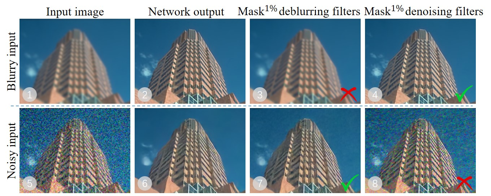

# FAIG (NIPS 2021 Spotlight)

This paper aims at **investigating the mechanism underlying the unified one-branch blind SR network**.
<br>
We propose a new diagnostic tool – Filter Attribution method based on Integral Gradient (FAIG) that utilizes paths in the parameter space in attributing network functional alterations to filter changes.

---
### :book: Finding Discriminative Filters for Specific Degradations in Blind Super-Resolution

> [[Paper](https://openreview.net/pdf?id=az0BBDjDvwD)] &emsp; [Project Page] &emsp; [[Video](https://recorder-v3.slideslive.com/?share=52246&s=fe236495-125a-44d7-9475-0907e5bf4e6e)] &emsp; [B站] &emsp; [[Poster](https://drive.google.com/file/d/1nWxje2HWXAibreJuzp2NM4PnsMUviaHE/view?usp=sharing)] &emsp; [[PPT slides](https://docs.google.com/presentation/d/1DwO8cKCuveIpflzijPpWjyndmZqKLQhI/edit?usp=sharing&ouid=113023682396793851067&rtpof=true&sd=true)]<br>
> [Liangbin Xie](https://liangbinxie.github.io/), [Xintao Wang](https://xinntao.github.io/), [Chao Dong](https://scholar.google.com.hk/citations?user=OSDCB0UAAAAJ), [Zhongang Qi](https://scholar.google.com/citations?user=zJvrrusAAAAJ&hl=en), [Ying Shan](https://scholar.google.com/citations?user=4oXBp9UAAAAJ&hl=en) <br>
> Tencent ARC Lab; Shenzhen Institutes of Advanced Technology, Chinese Academy of Sciences

<p align="center">
  
</p>

For a blurry input (➀) and noisy input (➄), the one-branch SRResNet for blind SR could remove blur (➁) and noise (➅), respectively. When we mask the 1% deblurring filters (discovered by the proposed FAIG), the corresponding network function of deblurring is eliminated (➂) while the function of denoising is maintained (➆). Similar phenomenon happens (➃ and ➇) when we mask the 1% denoising filters in the same network.

---

## :wrench: Dependencies and Installation

- Python >= 3.7 (Recommend to use [Anaconda](https://www.anaconda.com/download/#linux) or [Miniconda](https://docs.conda.io/en/latest/miniconda.html))
- [PyTorch >= 1.7](https://pytorch.org/)
- Option: NVIDIA GPU + [CUDA](https://developer.nvidia.com/cuda-downloads)
- Option: Linux

### Installation
1. Clone repo

    ```bash
    git clone https://github.com/xinntao/FAIG.git
    cd FAIG
    ```

1. Install dependent packages

    ```bash
    # Install basicsr - https://github.com/xinntao/BasicSR
    # We use BasicSR for both training and inference
    pip install basicsr
    pip install -r requirements.txt
    python setup.py develop
    ```


## :european_castle: Model Zoo

For both *SRCNN_Style network* and *SRResNet network*, we provide baseline model and target model. Download them from the link below and put them to the `experiments` folder.
- [SRCNN_Style](https://drive.google.com/drive/folders/153mRuXfDheNC0h3KnJsZRg8lB4ICWGZb?usp=sharing)
- [SRResNet](https://drive.google.com/drive/folders/1AtUzV3ENY4vywZcoMpdvHoxAeI7OK7fQ?usp=sharing)

You can also find all models here: [[Tencent Cloud 腾讯微云](https://share.weiyun.com/FoclquZP)]

## :zap: Quick Inference

Download the [neuron-search](https://drive.google.com/drive/folders/1At_f2tzFoGp62Nc2hrmuRU6eOlNpwNL-?usp=sharing) folder that contains the discovered filters (in descending order) by four different methods (FAIG, IG,  and random). Put it to the `results` folder. For each method, we provide the discovered filters for blur and noise degradation, respectively.

Before inference, please run the script to generate the degraded images.
```bash
python scripts/generate_lr.py
```

**Inference!**

For *SRCNN_Style* network
```bash
python analysis/Tools/srcnn_style/mask_neurons.py
```
For *SRResNet* network
```bash
python analysis/Tools/srresnet/mask_neurons.py
```
Then you can find the results (saved in `results/Interpret/masking`) of masking discovered specific filters with four proportions(1%, 3%, 5% and 10%) by four methods.
<br>
The directory structure (*maskdenoiseFilter/Blur2_LRbicx2*) means that the **blurry input image** is inferenced by the model that is **masked deblurring filters** (we hope this model loses deblur function while contains denoise function).

Description/Usage of all the provided scripts can be found in [analysis.md](analysis.md).


## :computer: Training

We provide the training codes for SRCNN_Style and SRResNet (used in our paper).
<br>
Other simple combination of degradations (scale ratio, different blur type, different noise type) with different levels are also verified. You can try them by yourself~

**Procedures**

Take SRResNet as an example.
1. Download the dataset: [DIV2K](http://data.vision.ee.ethz.ch/cvl/DIV2K/DIV2K_train_HR.zip)
2. Crop to sub-images.
    ```bash
    python scripts/extract_subimages.py
    ```
3. [Optional] Create LMDB files.
    ```bash
    python scripts/create_lmdb.py --dataset DIV2K
    ```
4. Modify the configuration file `options/train_srresnet_baseline.yml` accordingly.
5. Training the baseline model.
> python train.py -opt options/train_srresnet_baseline.yml
6. After finishing the training of baseline model, training the target model.
> python train.py -opt options/train_srresnet_target.yml

## :scroll: License and Acknowledgement

FAIG is released under Apache License Version 2.0.

## BibTeX

    @inproceedings{xie2021finding,
        title={Finding Discriminative Filters for Specific Degradations in Blind Super-Resolution},
        author={Liangbin Xie and Xintao Wang and Chao Dong and Zhongang Qi and Ying Shan},
        booktitle={{Advances in Neural Information Processing Systems (NeurIPS)}},
        volume={34},
        year={2021},
    }

## :e-mail: Contact

If you have any question, please email `lb.xie@siat.ac.cn`.
