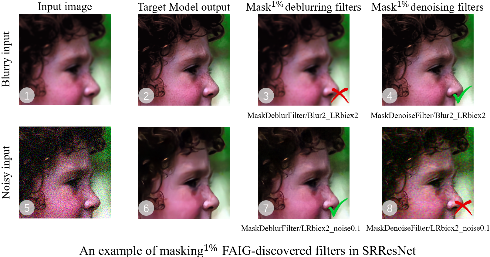
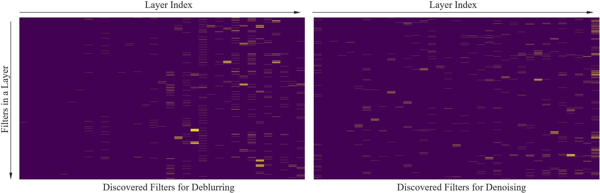
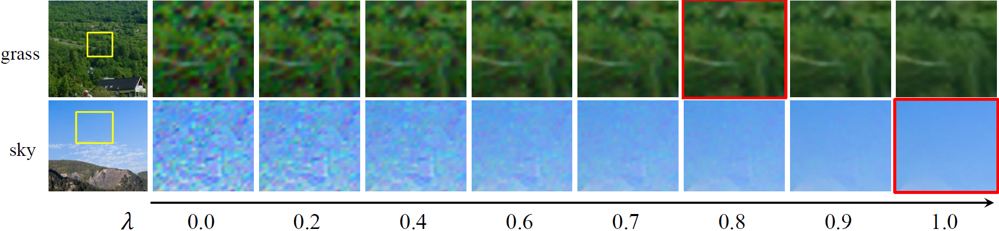
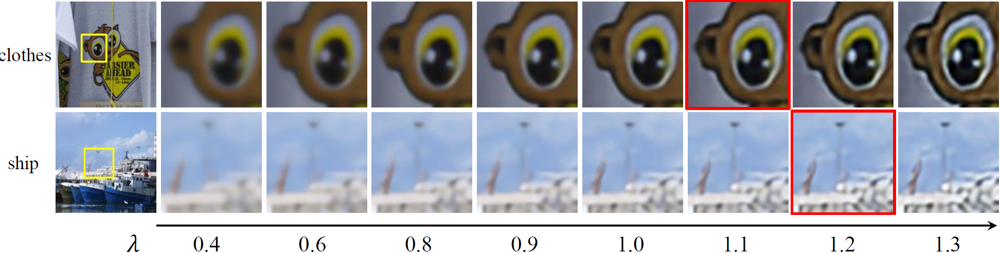

# :microscope: Description/Usage of analysis folder

- [Description of analysis Folder](#description-of-analysis-folder)
  - [Folder Structure](#folder-structure)
- [Usage of analysis Folder](#usage-of-analysis-folder)
  - [Find Filters For Specific Degradation](#Find-Filters-For-Specific-Degradation)
  - [Compare against these methods](#Compare-against-these-methods)
    - [Mask Discovered Filters](#Mask-Discovered-Filters)
  - [Filter Distribution Visualization](#Filter-Distribution-Visualization)
  - [Filter Modulation](#Filter-Modulation)

## Description of analysis Folder
All provided analysis scripts are contained in `analysis` folder.
### Folder Structure
```
analysis
├── scripts
|   ├── cal_blur_gradient_loss.py
|   ├── cal_noise_gradient_loss.py
|   ├── filter_modulation.py
|   ├── generate_gradient_map.py
|   ├── vis_filters_distribution.py
├── tools
│   ├── srcnn_style
|   |   ├── faig.py
│   │   ├── ig.py
│   │   ├── absolute_filter_change.py
│   │   ├── random_neurons.py
│   │   ├── mask_neurons.py
│   │   ├── comparison.py
│   ├── srresnet
│   │   ├── faig.py
│   │   ├── ig.py
│   │   ├── absolute_filter_change.py
│   │   ├── random_neurons.py
│   │   ├── mask_neurons.py
│   │   ├── comparison.py
```

## Usage of analysis Folder

### Find Filters For Specific Degradation

For both SRCNN_Style network and SRResNet network, we provide four different methods to find filters for specific degradations, which are FAIG, IG, , and random. You just need to run the corresponding scripts and you can get the txt file that records the sorted filters of specific degradation in descending order. Note that you need to run all these four scripts. Take FAIG as an example,
```bash
python analysis/tools/srresnet/faig.py
```
Output results are saved in the `results/Interpret/neuron-search` folder.

---
### Compare against these methods
To quantify the discovered filters' contribution to the network function, you first need to run the following script to use the target model to restore different degraded images. Take SRResNet as an example,
```bash
python inference/inference_srresnet.py
```

Then, for both SRCNN_Style network and SRResNet network, we provide a script [analysis/Tools/SRResNet/comparison.py](analysis/Tools/SRResNet/comparison.py) to compare the performance of FAIG, IG,  and random. It automatically includes several steps:

- Replace the weights of discovered filters (1%, 3%, 5%, 10%) in target model with those filters (at the same location) in baseline model and obtain a substituted model.
- Use this substituted model to restore different degraded images (e.g, blurry or noisy images).
- Generate the gray gradient map of images (saved in **npy** format).
- Quantify the discovered filters' contribution to the network function by measuring output difference (MSE of gradient map) of target model and the substituted model.

```bash
python analysis/tools/srresnet/comparison.py
```

Output results are saved in `results` folder, the folder structure is

```
results
├── Interpret
|   ├── gradient  # contains the generated gray gradient map
|   ├── Masking   # contains the restored results of the substituted model
|   ├── metrics   # records the output difference
```
#### Mask Discovered Filters

Specifically, we introduce the naming rule of `results/Interpret/Masking` folder. When you delve into this folder, you will find some complicated directory structures (e.g, *MaskdenoiseFilter/Blur2_LRbicx2*), it means that the **blurry input image** is inferenced by the model that is **masked deblurring filters** (we hope this new model loses deblur function while contains denoise function). For the FAIG-discovered filters, you can observe the similar phenomenon as the picture shown below.


<p align="center">
  
</p>

---
### Filter Distribution Visualization
We provide a script [analysis/scripts/vis_filters_distribution.py](analysis/scripts/vis_filters_distribution.py) to help visualize the discovered 1% filters in SRResNet for different function.

```bash
python analysis/scripts/vis_filters_distribution.py
```

<p align="center">
  
</p>

**The deblurring filters are more located in the back part of the network while denoising filters locate more uniformly.**

---
### Filter Modulation

We provide a script [analysis/scripts/filter_modulation.py](analysis/scripts/filter_modulation.py) to achieve controllable restoration based on the FAIG-discovered discriminative filters. After adjusting , you can get a similar phenomenon as shown in Figure 10 and Figure 11 of the supplementary file.

```bash
python analysis/scripts/filter_modulation.py
```

<p align="center">
  
</p>

<p align="center">
We can adjust coefficient  for denoising filters to obtain continuous denoising effect.
</p>

<p align="center">
  
</p>

<p align="center">
We can adjust coefficient  for deblurring filters to obtain continuous deblurring effect.
</p>
